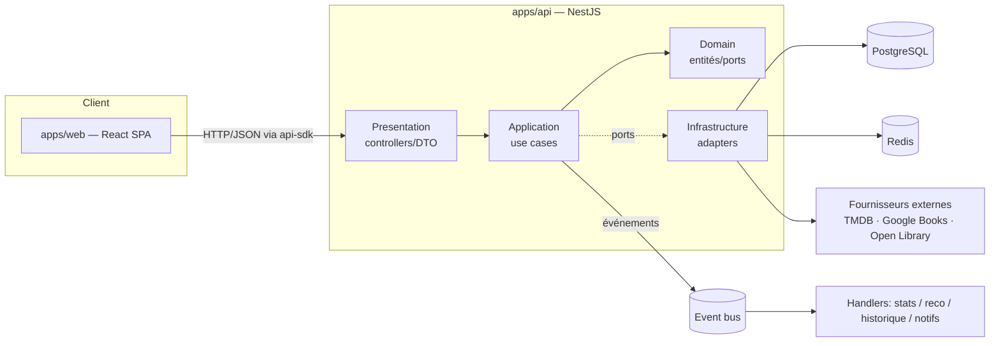
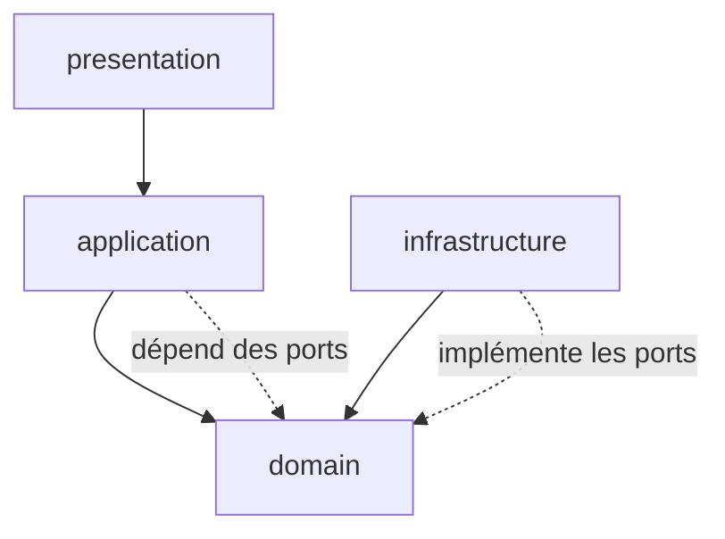
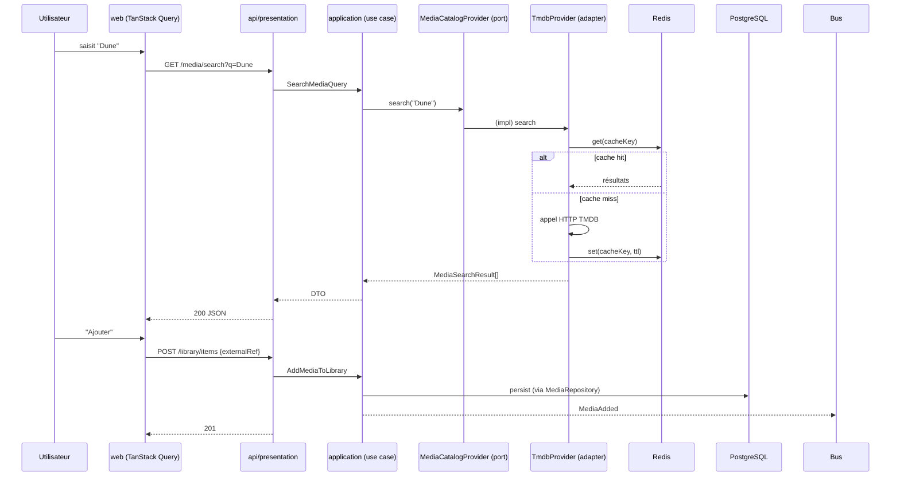
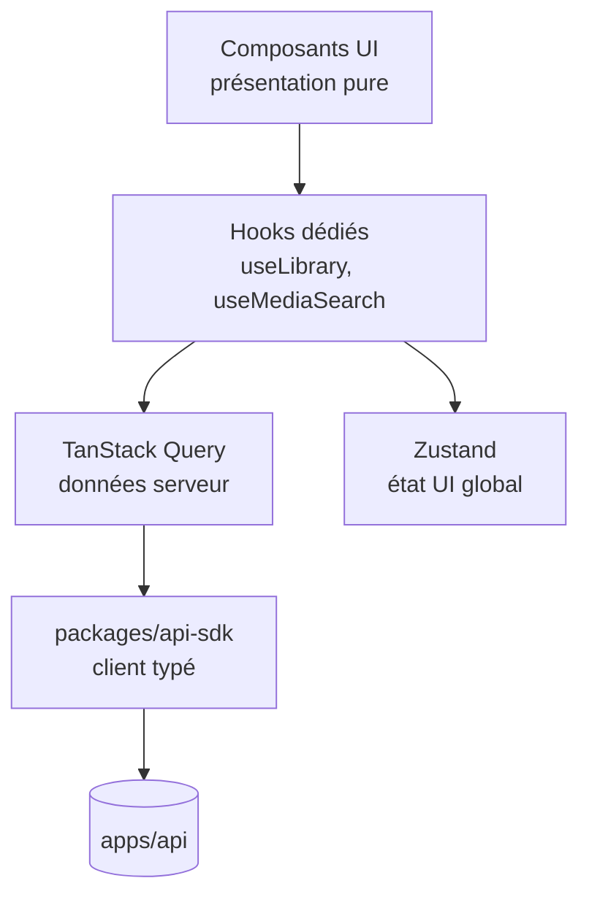

# 02 — Architecture générale & flux de données

## 1. Principes directeurs

1. **Clean / Hexagonale** : le métier au centre, l'infrastructure en périphérie, via **ports & adapters**.
2. **Générique d'abord** : `Media` est le concept pivot ; les types concrets sont des extensions.
3. **Contrats explicites** : le frontend consomme l'API via un SDK typé généré depuis des contrats.
4. **Event-driven interne** : les use cases émettent des événements de domaine.
5. **Éco par défaut** : chaque couche est pensée pour minimiser réseau, CPU et données transférées.

## 2. Vue macro



## 3. Couches backend (par module)

```
modules/<domaine>/
├── domain/          ← entités, VO, règles, PORTS (interfaces). Zéro dépendance externe.
├── application/     ← use cases (commands/queries), orchestration, émission d'événements.
├── infrastructure/  ← adapters: Prisma repo, providers externes, cache Redis. Implémente les ports.
└── presentation/    ← controllers HTTP, DTO, validation (Zod/class-validator), mapping.
```

**Règle de dépendance (Dependency Rule)** — les flèches pointent vers l'intérieur :



Le `domain` ne connaît ni Prisma, ni NestJS, ni TMDB. L'`infrastructure` dépend du `domain`
(pas l'inverse) en implémentant ses **ports**.

## 4. Ports & Adapters — exemple `Media`

| Port (domain) | Adapter (infrastructure) |
| --- | --- |
| `MediaRepository` | `PrismaMediaRepository` |
| `MediaCatalogProvider` (socle) | `TmdbProvider` (films/séries), `CompositeBookCatalogProvider` (livres) |
| `SeriesCatalogProvider` / `TrendingCatalogProvider` (capacités) | `TmdbProvider` |
| `MediaCatalogRegistry` | `TypeBasedMediaCatalogRegistry` — route par `MediaType` (ADR-0015) |
| `BookProvider` | `GoogleBooksProvider` (prioritaire), `OpenLibraryProvider` (secours) — ADR-0016 |
| `CacheStore` | `RedisCacheStore` |
| `EventPublisher` | `InMemoryEventBus` (MVP) → `BullMQEventBus` (Redis) |

Le domaine manipule uniquement les **interfaces**. Changer TMDB → Trakt = un nouvel adapter,
**aucune modification métier**.

## 5. Flux — « Rechercher puis ajouter un média »



## 6. Frontend — séparation stricte



- Un composant **ne** fait **jamais** d'appel API ni de logique métier : il consomme des hooks.
- `TanStack Query` = cache/état des **données serveur** (retries, staleTime → éco réseau).
- `Zustand` = **uniquement** état applicatif global (thème, préférences UI, session légère).

## 7. Contrats & versionnement

- `contracts/` héberge les schémas d'API partagés (OpenAPI + schémas Zod partagés dans
  `packages/types`).
- `packages/api-sdk` expose un client **généré/typé** à partir de ces contrats.
- Toute évolution incompatible = **v2** de contrat + note de migration ; pas d'accès direct aux
  internals d'un service.

## 8. Éco-conception dans l'architecture

- Cache multi-niveaux (HTTP `Cache-Control`, Redis) pour éviter les appels externes redondants.
- Pagination + `select` SQL ciblés (jamais `SELECT *` inutile) via Prisma.
- Images servies redimensionnées / formats modernes, `loading="lazy"`.
- Mutations **optimistes** côté client pour réduire allers-retours perçus.
- Découpage du bundle (routes lazy) pour limiter le JS transféré.
