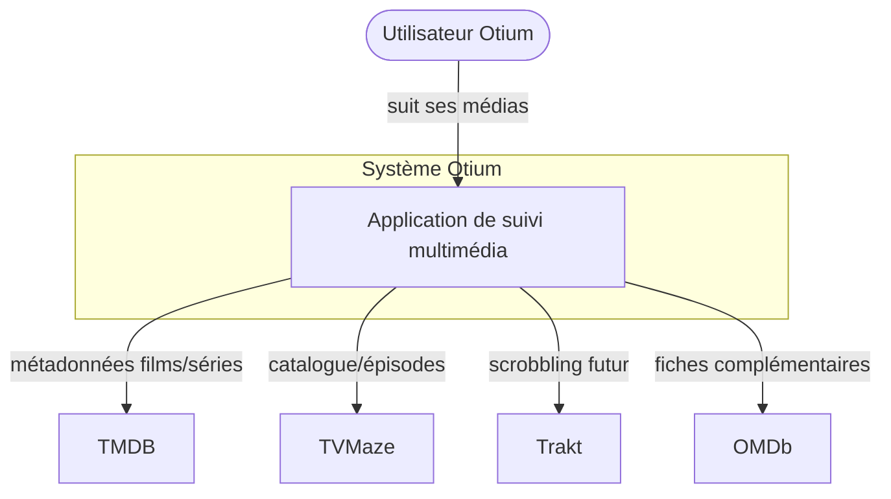
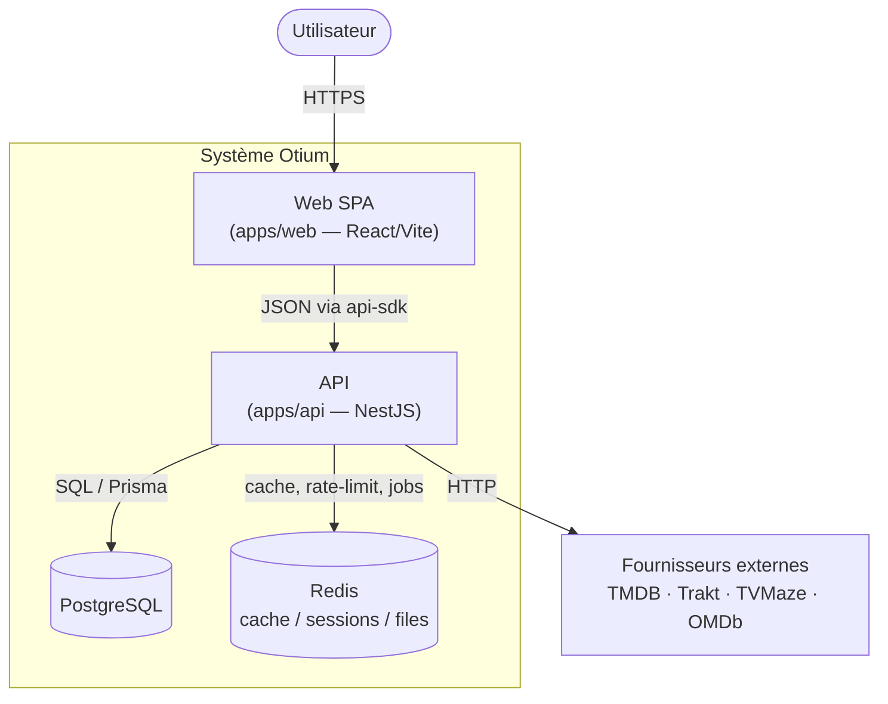
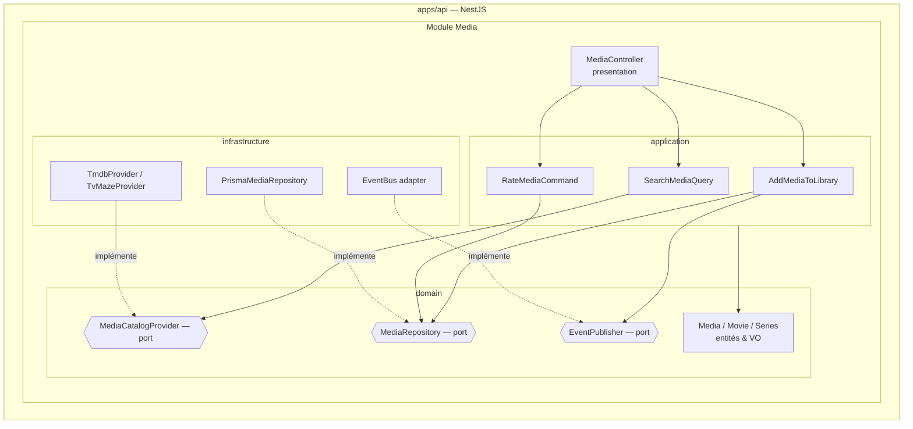
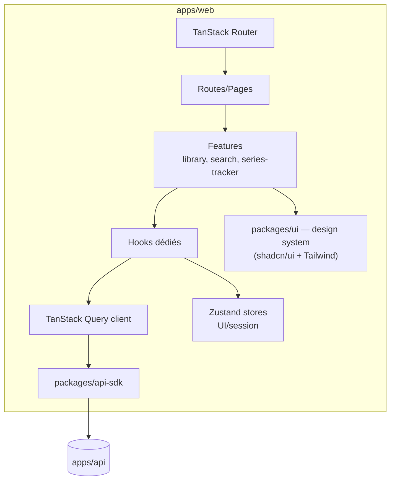

# 03 — Diagrammes C4

Modèle [C4](https://c4model.com/) : Contexte → Conteneurs → Composants → (Code, hors doc).

## Niveau 1 — Contexte système

## Niveau 2 — Conteneurs

## Niveau 3 — Composants de l'API (module `media` en exemple)

## Niveau 3 — Composants du Web

> Le niveau 4 (Code) n'est pas figé en documentation : il vit dans le code et ses tests.
