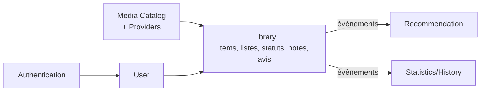
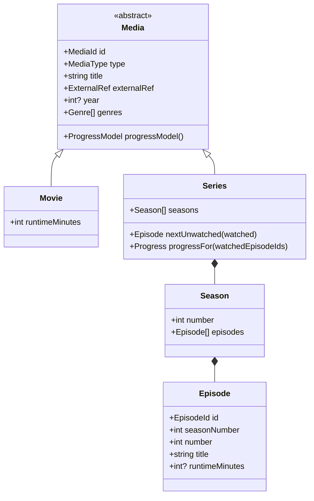
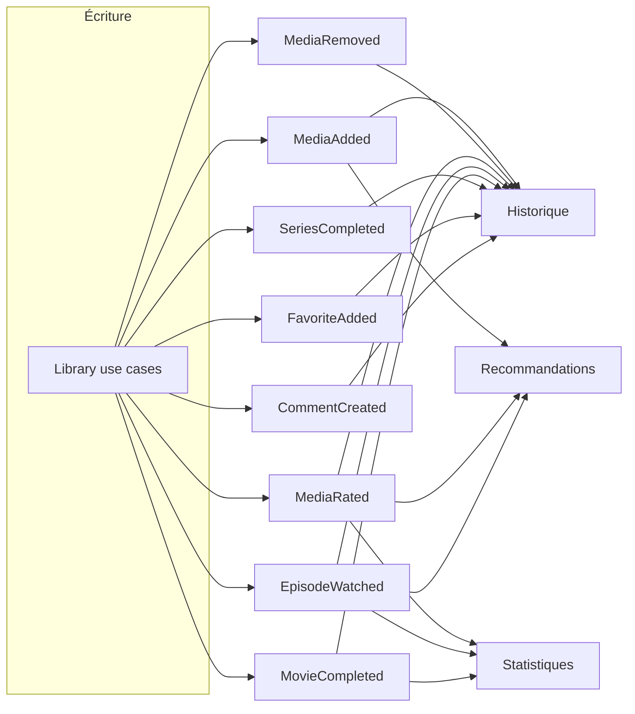

# 05 — Modèle métier (DDD léger)

## 1. Langage ubiquitaire

| Terme | Définition |
| --- | --- |
| **Media** | Concept **générique** d'œuvre culturelle suivie (film, série, livre, jeu…). |
| **MediaType** | Discriminant du type (`MOVIE`, `SERIES`, futur : `BOOK`, `GAME`…). |
| **ExternalRef** | Référence stable vers une source externe (`provider` + `externalId`). |
| **LibraryItem** | Relation *utilisateur ↔ média* dans sa bibliothèque (statut, note, favori). |
| **WatchStatus** | État de consommation (`PLANNED`, `IN_PROGRESS`, `COMPLETED`, `DROPPED`, `PAUSED`). |
| **List** | Regroupement personnalisé de médias (créé par l'utilisateur). |
| **Progress** | Avancement dans un média (générique ; spécialisé par type). |
| **Rating** | Note attribuée par l'utilisateur (VO validant l'échelle). |
| **Review** | Avis textuel. |

## 2. Contextes bornés (Bounded Contexts)



- **Authentication** : identité, sessions, sécurité.
- **User** : profil, préférences (thème, langue).
- **Media Catalog** : recherche/détails via fournisseurs externes, cache, normalisation.
- **Library** (cœur transactionnel) : ce que l'utilisateur suit et son état.
- **Recommendation / Statistics** : consommateurs d'événements (lecture seule côté écriture).

## 3. Modèle générique `Media`

Le pivot est `Media`. Les types concrets **spécialisent** sans dupliquer les capacités communes.



### Choix de modélisation : extension, pas modification

Ajouter un **nouveau type** de média = :
1. une nouvelle sous-entité de `Media` (ex. `Book`) + son `ProgressModel` ;
2. un ou des **adapters** `MediaCatalogProvider` fournissant ce type ;
3. **aucune** modification des capacités transversales (`LibraryItem`, favoris, notes, listes…).

Le **suivi de progression** est abstrait via un `ProgressModel` polymorphe :
- `Movie` → progression binaire (vu / non vu) ;
- `Series` → progression par ensemble d'`Episode` vus, avec calcul du **prochain non vu** ;
- `Book` (futur) → progression par pages/chapitres.

> C'est ce point qui évite le piège « logique uniquement Movie/Series » : la reprise, la
> complétion et le pourcentage d'avancement sont exprimés par le `ProgressModel`, pas par du
> code spécifique éparpillé.

## 4. Agrégats & invariants

| Agrégat (racine) | Contenu | Invariants clés |
| --- | --- | --- |
| **Media** (`Series` inclut `Season`/`Episode`) | métadonnées + structure | épisodes uniques par (saison, numéro) ; type immuable |
| **LibraryItem** | statut, favori, rating, progress | un seul `LibraryItem` par (user, media) ; note dans l'échelle ; `COMPLETED` ⇒ progression pleine |
| **List** | items ordonnés | pas de doublon de média dans une liste |
| **Review** | texte, rating optionnel | un avis courant par (user, media) éditable |

## 5. Value Objects

- `MediaId`, `EpisodeId`, `UserId`, `ListId` — identifiants typés (pas de `string` nu).
- `ExternalRef { provider, externalId }` — égalité par valeur.
- `MediaType` — enum fermé mais **extensible** (ajout d'une valeur, pas refonte).
- `WatchStatus` — enum + transitions valides.
- `Rating` — encapsule l'échelle **0 à 10 (entiers)** et sa validation (0 = non noté/rejeté selon contexte, 1–10 = note). Décision produit validée.
- `Genre` — normalisé (mapping providers → référentiel interne).

## 6. Événements de domaine



Chaque événement porte : `occurredAt`, `userId`, `mediaId` (+ payload spécifique). Ils sont la
**source** de l'historique, des stats et des recommandations — pas des calculs ad hoc.

## 7. Règles métier notables

1. Les capacités transversales s'appliquent à **tout** `Media` (jamais dupliquées par type).
2. `Series.nextUnwatched(watchedEpisodeIds)` renvoie le **premier** épisode non vu dans l'ordre
   (saison, numéro) → base de la **reprise automatique**.
3. Marquer un épisode vu peut déclencher `SeriesCompleted` si c'était le dernier.
4. Passer un `LibraryItem` à `COMPLETED` force la progression à « pleine » de façon cohérente
   avec le `ProgressModel`.
5. Le domaine ignore totalement d'où viennent les données (`ExternalRef` est opaque au métier).

## 8. Esquisse de persistance (indicative, non contraignante pour le domaine)

> Le schéma Prisma vit dans l'infrastructure ; le domaine ne le connaît pas. Esquisse relationnelle :

```
users(id, email, ...)
media(id, type, title, year, external_provider, external_id, ...)     # UNIQUE(external_provider, external_id)
seasons(id, media_id, number)
episodes(id, season_id, number, title, runtime)
library_items(id, user_id, media_id, status, rating, is_favorite, ...) # UNIQUE(user_id, media_id)
watched_episodes(library_item_id, episode_id, watched_at)
lists(id, user_id, name)
list_items(list_id, media_id, position)
reviews(id, user_id, media_id, body, rating, ...)
domain_events(id, type, user_id, media_id, payload, occurred_at)       # journal d'événements
```
