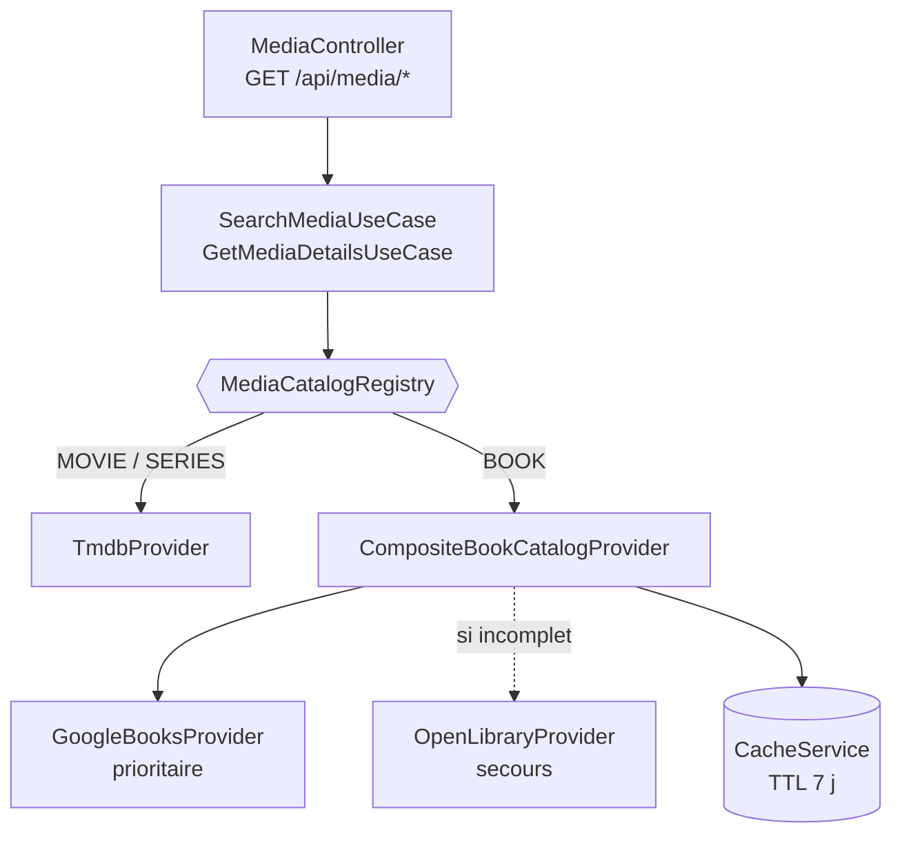

# 07 — Catalogue de livres (providers, fusion, extension)

> Décisions associées : [ADR-0015](../adr/0015-registry-catalogues-par-type.md) (registry),
> [ADR-0016](../adr/0016-fusion-google-books-open-library.md) (fusion),
> [ADR-0017](../adr/0017-progression-polymorphe.md) (progression).

## 1. Vue d'ensemble

Un livre est un `Media` comme un autre : favoris, listes, notation, avis et statistiques sont les
capacités **génériques** déjà en place (ADR-0003). Seules deux choses lui sont propres — d'où viennent
ses données, et comment on suit sa lecture.



Le registry est **le seul** endroit qui sait quel fournisseur couvre quel type. Les use cases n'en
savent rien ; le domaine encore moins.

## 2. Couches du module `books`

```
modules/books/
├── domain/                       ← aucune dépendance externe, testé sans I/O
│   ├── models/book.ts            BookRecord : modèle normalisé, commun aux sources
│   ├── isbn.ts                   value object ISBN (validation clé de contrôle)
│   ├── merge-books.ts            RÈGLE DE FUSION (pure) + déduplication
│   ├── to-catalog.ts             livre → modèle générique du catalogue
│   └── ports/book-provider.ts    port d'une source + jetons DI
├── infrastructure/
│   ├── google-books/             adapter + mapper + types bruts
│   ├── open-library/             adapter + mapper + types bruts
│   └── composite-book-catalog.provider.ts   orchestration, cache, résilience
└── books.module.ts               câblage : qui est prioritaire, qui est secours
```

Règle de lecture : **la politique est pure, la plomberie est technique.** Ce qui décide *quelle
donnée gagne* est dans `domain/merge-books.ts` ; ce qui décide *quand appeler le réseau* est dans
l'orchestrateur.

## 3. Flux de récupération

### Recherche `GET /api/media/search?q=…&types=BOOK`

1. Cache (`books:search:<page>:<taille>:<requête>`) — servi tel quel si présent.
2. **Google Books**. Un ISBN saisi (clé de contrôle valide) bascule en recherche exacte `isbn:` ;
   sinon la requête reste libre, ce qui préserve la tolérance aux fautes de frappe native de Google.
3. **Open Library** — uniquement si Google n'a rien retourné ou est indisponible.
4. Déduplication (`dedupeBooks`), troncature à la taille de page, mise en cache.

### Fiche `GET /api/media/BOOK/:externalId`

1. Cache (`books:details:<id>`).
2. Fiche Google Books (ou recherche par ISBN si `externalId` **est** un ISBN).
3. `needsFallback` ? — couverture, description ou ISBN-13 manquant → Open Library, rapproché par
   ISBN si connu, sinon par titre + auteur.
4. `mergeBooks(prioritaire, secours)` — le secours **comble**, il n'écrase jamais.
5. Traduction vers le modèle générique (`toCatalogMediaDetails`), mise en cache.

## 4. Stratégie de fusion

| Situation | Comportement |
| --- | --- |
| Champ renseigné chez Google Books | Conservé, quoi qu'en dise Open Library |
| Champ `null` chez Google Books | Comblé par Open Library si disponible |
| Liste vide (auteurs, catégories) | Comblée par Open Library ; deux listes pleines ne sont pas mélangées |
| Titre vide côté prioritaire | Seul cas où le secours reprend la main sur un champ existant |
| Identifiant / source | Toujours ceux du prioritaire (les références externes doivent rester stables) |
| `sources` | Union ordonnée — exposée jusqu'à l'API, la fusion reste auditable |

## 5. Gestion des erreurs

| Cas | Comportement observable |
| --- | --- |
| Google Books indisponible | Open Library répond seul ; recherche et fiche fonctionnent |
| Open Library indisponible | La fiche Google Books est servie, non complétée |
| Les deux indisponibles | `503` explicite, message en français |
| Aucun résultat | Page vide (`items: []`), **pas** une erreur |
| Livre introuvable (fiche) | `404` |
| Données incomplètes | Champs `null` ; l'interface masque ce qu'elle ne peut pas afficher |
| Couverture manquante | Bloc d'illustration neutre (composant partagé, déjà en place) |
| Quota / 429 | **2 nouvelles tentatives** (délai croissant), puis bascule + cache long |
| `503 backendFailed` Google | Idem : Google Books en renvoie fréquemment de purement transitoires |
| ISBN invalide dans une réponse | Écarté par la validation de clé de contrôle |

Aucun de ces cas n'interrompt l'ajout en bibliothèque : l'enrichissement est *best-effort*.

> **Mesuré en conditions réelles (2026-07-20)** : Google Books renvoie ~2 `503 backendFailed` sur 3
> requêtes depuis un poste de développement, clé API valide comprise. Sans réessai, la source
> prioritaire ne répondait pratiquement jamais et Open Library assurait tout le service. Avec deux
> nouvelles tentatives, Google Books redevient majoritaire (4 requêtes sur 5 mesurées).

> **Secrets** : les clés voyagent en query string chez ces fournisseurs. `HttpRequestError` masque
> systématiquement `key`, `api_key`, `access_token` et `token` — aucune URL journalisée ne contient
> de secret, quel que soit l'appelant.

## 6. Suivi de lecture

La progression est **générique** et vit sur `LibraryItem` (ADR-0017) :
`PATCH /api/library/:itemId/progress` avec `{ unit: "PAGES" | "PERCENT", value, total? }`.

Le serveur borne la saisie, calcule `percent` et `remaining`, déduit statut et dates, et journalise
le delta dans `ProgressEntry` — source des statistiques « pages par mois » et « rythme de lecture ».
Les clients affichent, ils ne calculent pas.

## 7. Livres communautaires et réconciliation

Un ouvrage qu'aucun fournisseur ne connaît peut être **saisi par l'utilisateur**
(`POST /api/books`, seul le titre est requis). Il devient un `Media` ordinaire — seul son
`externalProvider` (`community`) le distingue — donc bibliothèque, suivi, statistiques,
favoris et listes le traitent comme n'importe quel livre, sans code dédié.

En recherche, le dépôt communautaire est interrogé **en parallèle** des sources distantes,
jamais en repli, et ses résultats passent en tête : l'utilisateur a saisi ce livre parce
qu'aucun catalogue ne le connaissait.

### Réconciliation hebdomadaire

Une tâche périodique (ADR-0019) vérifie si ces livres sont depuis entrés au catalogue.
Elle est déclenchée par une recherche de livres, sans être attendue, et traite un lot borné
par exécution — le reliquat passe à l'échéance suivante.

| Étape | Comportement |
| --- | --- |
| Recherche du candidat | par **ISBN** si connu (c'est une identité), sinon titre + auteur |
| Ordre des sources | Google Books, puis Open Library ; une panne n'interrompt pas la tâche |
| Décision | `matchCommunityBook`, **fonction pure** — seul un verdict `CERTAIN` associe |
| Association | la **même ligne** change de référence externe ; rien n'est recréé |
| Ouvrage officiel déjà suivi | on ne touche à rien (fusionner deux bibliothèques est une autre opération) |

**Anti-faux-positifs.** L'enjeu n'est pas de rapprocher le plus possible : une association
erronée remplacerait le livre d'un utilisateur par un autre, en emportant sa note, son avis
et sa progression. Un rapprochement manqué, lui, ne coûte rien — le livre sera réexaminé.

| Signal | Verdict |
| --- | --- |
| ISBN identique | rapprochement, quels que soient les titres |
| ISBN différents | refus, même sur titre identique |
| Titre + auteur identiques, année compatible (± 1 an) | rapprochement |
| Titre identique, auteur différent | **refus** (« Dune » / « Dune, le mook ») |
| Auteur absent d'un côté | **refus** — il ne resterait que le titre |
| Années éloignées | refus |

**Préservation des données utilisateur.** Elle est garantie *par construction*, non par une
recopie : bibliothèques, notes, avis, favoris, dates, progression et historique pointent
sur l'identifiant **interne** du média, qui ne change pas. Seules les métadonnées
s'enrichissent, et `sources` conserve la trace de l'origine communautaire.

## 8. Points d'extension

| Besoin futur | Geste attendu |
| --- | --- |
| Ajouter une source de livres (Babelio, ISBNdb…) | Un adapter `BookProvider` + une liaison dans `books.module.ts` |
| Changer la source prioritaire | Inverser les jetons `PRIMARY_` / `FALLBACK_` (⚠️ migration des `externalId`) |
| Ajuster ce qu'est une fiche « complète » | `needsFallback`, un seul point |
| Ajouter un type de média (manga, BD…) | Un module catalogue + une ligne dans `CATALOG_PROVIDER_REGISTRATIONS` |
| Suivre en chapitres ou en tomes | Une valeur d'enum `ProgressUnit` + son total effectif |
| Temps de lecture restant estimé | Dérivable de `ProgressEntry` (rythme) × pages restantes — aucune migration |
| Tendances livres | Implémenter `TrendingCatalogProvider` le jour où une source en expose |
| Assouplir/durcir le rapprochement | `matchCommunityBook`, fonction pure — un seul point, testable |
| Fusionner deux médias déjà suivis | Non traité : la réconciliation s'abstient quand l'ouvrage officiel existe déjà |
