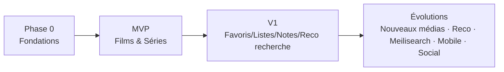

# Roadmap de développement

Découpage par incréments livrables. Chaque incrément respecte la **Definition of Done** de
[`CLAUDE.md`](../CLAUDE.md) (tests + eval + métriques + doc). Pas de dette technique subie.

## Phase 0 — Fondations (avant toute fonctionnalité) ✅

- [x] Scaffolding monorepo (Turborepo + pnpm), `packages/config` (tsconfig/eslint/prettier).
- [x] `packages/types` (schémas Zod de base) + `packages/utils` (`Result`, invariants).
- [x] `packages/api-sdk` (client HTTP typé) + `packages/ui` (thèmes clair/sombre, tokens, primitives).
- [x] `apps/api` NestJS : `shared/` (Entity, ValueObject, DomainEvent, ports), config validée (Zod),
      Prisma, Redis, bus d'événements in-memory, module `health`.
- [x] `apps/web` Vite : shell, providers (Query, thème, router), design tokens, page d'accueil.
- [x] Infra dev : docker-compose (PostgreSQL + Redis), schéma Prisma, CI GitHub Actions
      (typecheck/lint/test/build).
- **Sortie** : pipeline vert (`typecheck`/`lint`/`test`/`build` sur 7 packages). Reste à exécuter
      la migration Prisma initiale une fois Docker démarré, puis `pnpm dev`.

## MVP — « je suis mes films et séries »

Objectif : un utilisateur s'inscrit, cherche, ajoute, et suit sa progression série.

1. **Auth** (module `authentication` + `user`) — inscription/connexion, sessions Redis.
2. **Catalogue** (`media`) — recherche + détails via **1 provider** (TMDB), cache Redis.
3. **Bibliothèque** (`library`) — ajout/retrait, `WatchStatus`.
4. **Séries** — saisons/épisodes, marquer épisode vu, **reprise (next unwatched)**.
5. **Films** — statut vu/à voir/complété.
6. **Événements** — `MediaAdded`, `EpisodeWatched`, `MovieCompleted` (+ journal).

**Métriques MVP** : « recherche → ajout » p95 < 3 s ; reprise exacte 100 % ; LCP mobile < 2,5 s.

## V1 — « une vraie bibliothèque personnelle »

7. **Favoris** + **listes personnalisées**.
8. **Notation** + **avis** + **historique** (dérivé des événements).
9. **Recherche avancée** — Postgres FTS, filtres, genres, tri, pagination.
10. **Statistiques de base** (temps, volumes) alimentées par les événements.
11. **Polish UX** — états vides, skeletons partout, animations, accessibilité AA, i18n FR.
12. **Providers additionnels** (TVMaze/OMDb) via le registry, sans toucher au métier.

**Métriques V1** : couverture des parcours clés testés E2E ; score éco (APIGreenScore) suivi.

## Évolutions (post-V1)

- **Nouveaux types de médias** : livres, jeux, animés (extension `Media` + providers dédiés).
- **Recommandations** personnalisées (consommateur d'événements → modèle simple puis avancé).
- **Meilisearch** (bascule recherche derrière le même port).
- **Notifications** (nouveaux épisodes, sorties).
- **Social** (activité d'amis, partage de listes).
- **Mobile** (l'API + `api-sdk` typé le permettent déjà).
- **Trakt** (synchro/scrobbling).

## Jalons de qualité transverses (continus)

- Budget perf/éco par écran (poids JS, images, appels réseau) suivi en CI.
- Suite d'eval par fonctionnalité maintenue.
- Revue d'architecture à chaque nouveau module (respect Dependency Rule).

## Séquencement visuel

