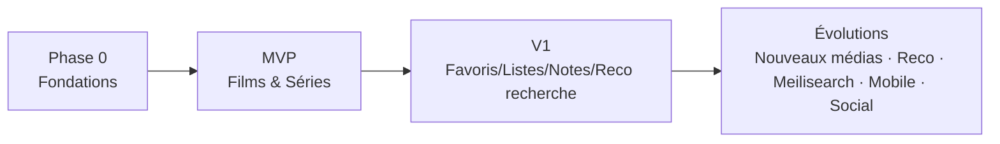

# Roadmap de développement

Découpage par incréments livrables. Chaque incrément respecte la **Definition of Done** de
[`CLAUDE.md`](../CLAUDE.md) (tests + eval + métriques + doc). Pas de dette technique subie.

## Phase 0 — Fondations (avant toute fonctionnalité) ✅

- [x] Scaffolding monorepo (Turborepo + pnpm), `packages/config` (tsconfig/eslint/prettier).
- [x] `packages/types` (schémas Zod de base) + `packages/utils` (`Result`, invariants).
- [x] `packages/api-sdk` (client HTTP typé) + `packages/ui` (thèmes clair/sombre, tokens, primitives).
- [x] `apps/api` NestJS : `shared/` (Entity, ValueObject, DomainEvent, ports), config validée (Zod),
      Prisma, Redis, bus d'événements in-memory, module `health`.
- [x] `apps/web` Vite : shell, providers (Query, thème, router), design tokens, page d'accueil.
- [x] Infra dev : docker-compose (PostgreSQL + Redis), schéma Prisma, CI GitHub Actions
      (typecheck/lint/test/build).
- **Sortie** : pipeline vert (`typecheck`/`lint`/`test`/`build` sur 7 packages). Reste à exécuter
      la migration Prisma initiale une fois Docker démarré, puis `pnpm dev`.

## MVP — « je suis mes films et séries » ✅ (livré et mergé sur `main`, 2026-07-15)

Objectif atteint : un utilisateur s'inscrit, cherche, ajoute, note/commente et suit sa progression série.

1. [x] **Auth** (`authentication` + `user`) — inscription/connexion, bcrypt, sessions Redis, `AuthGuard`.
2. [x] **Catalogue** (`media`) — recherche + détails séries via **TMDB** (port + adapter), cache Redis.
3. [x] **Bibliothèque** (`library`) — ajout/retrait, `WatchStatus`, favoris (niveau `Media`).
4. [x] **Séries** — saisons/épisodes, marquer épisode vu, **reprise (`nextUnwatched`)**, statuts.
5. [x] **Films** — statut ; note 0–10 et avis (transversaux `Media`).
6. [x] **Événements** — `MediaAdded`, `EpisodeWatched`, `MediaRated`, `CommentCreated`… (journal `DomainEvent`).

**Polish livré (2026-07-15)** :
- [x] **i18n des messages de validation** — carte d'erreurs Zod française partagée front/back
  (`setupFrenchZodErrors`, `@otium/types`).
- [x] **Jeton en cookie httpOnly** — session posée/lue via cookie `otium_session` (anti-XSS),
  repli Bearer pour les clients non-navigateur ; le web ne manipule plus de jeton.
- [x] **Statut « vu » / « à voir »** — changement de `WatchStatus` au niveau `Media`
  (`PATCH /library/:id/status`), événements `WatchStatusChanged` / `MovieCompleted`.
- [x] **Accueil personnalisé** — tableau de bord `GET /library/home` cloisonné par type de média :
  **à reprendre** (série commencée avec un épisode sorti non vu) puis **à commencer** (série non
  commencée déjà disponible). Onglet **« À venir »** (`GET /library/upcoming`) : épisodes à diffusion
  future des séries suivies. S'appuie sur les **dates de diffusion** (`Episode.airDate`, fournies par
  TMDB) et la synchronisation de la structure d'une série à l'ajout.
- [x] **Bibliothèque par catégorie** — sélecteur Films / Séries (jamais les deux en même temps).
- [x] **Mise en avant dans la recherche** — tendances du moment (films/séries) sous la barre
  (`GET /media/trending`, TMDB `trending`).

- [x] **Fiche média détaillée** — page unique `/media/:type/:externalId` (backdrop, note TMDB,
  synopsis, genres, durée/saisons, casting, réalisateur/créateurs, sociétés, plateformes),
  partagée entre la recherche et la bibliothèque, avec actions perso contextualisées
  (`GET /media/:type/:externalId`, `append_to_response` TMDB, cache Redis).

**Reste (polish MVP → V1)** : mesure des métriques.

**Métriques MVP** : « recherche → ajout » p95 < 3 s ; reprise exacte 100 % ; LCP mobile < 2,5 s.

## V1 — « une vraie bibliothèque personnelle »

7. **Favoris** ✅ + **listes personnalisées** ✅ — CRUD de listes (`/lists`), ajout/retrait de
   médias (au niveau `Media`), événements `ListCreated`/`ListItemAdded`/`ListItemRemoved`/`ListDeleted`.
8. **Notation** ✅ + **avis** ✅ + **historique** (à dériver des événements journalisés).
9. **Recherche avancée** — Postgres FTS, filtres, genres, tri, pagination.
10. **Statistiques de visionnage** ✅ — tableau de bord `/stats` (`GET /stats`) : totaux
    (films/séries/épisodes, temps), répartition, genres les plus regardés, activité par mois,
    note moyenne, records. Agrégations Prisma + builder pur ; graphiques recharts (chunk
    séparé, palette CVD validée). Genres/durée persistés à l'ajout (enrichissement catalogue),
    avec backfill best-effort de la durée d'un film au passage « vu » (films ajoutés avant
    l'enrichissement, ou dont l'enrichissement avait échoué) — garantit le temps de visionnage films.
11. **Import de données externes (RGPD)** ✅ — module `import` (orchestration) : archive ZIP →
    parseurs de source enfichables (TV Time : films v1 + séries/épisodes v2) → rapprochement TMDB
    par nom+année (heuristique pure) → réutilisation du métier (ajout, statut « vu », suivi
    d'épisodes). `POST /import/tvtime`, page `/import`, rapport (importés/déjà présents/non trouvés).
    Best-effort, cache Redis (ADR-0008).
12. **Polish UX** — états vides, skeletons partout, animations, accessibilité AA, i18n FR.
13. **Providers additionnels** (TVMaze/OMDb) via le registry, sans toucher au métier.

**Métriques V1** : couverture des parcours clés testés E2E ; score éco (APIGreenScore) suivi.

## Évolutions (post-V1)

- **Nouveaux types de médias** : livres, jeux, animés (extension `Media` + providers dédiés).
- **Recommandations** personnalisées (consommateur d'événements → modèle simple puis avancé).
- **Meilisearch** (bascule recherche derrière le même port).
- **Notifications** (nouveaux épisodes, sorties).
- **Social** (activité d'amis, partage de listes).
- **Mobile** (l'API + `api-sdk` typé le permettent déjà).
- **Trakt** (synchro/scrobbling).

## Jalons de qualité transverses (continus)

- Budget perf/éco par écran (poids JS, images, appels réseau) suivi en CI.
- Suite d'eval par fonctionnalité maintenue.
- Revue d'architecture à chaque nouveau module (respect Dependency Rule).

## Séquencement visuel

