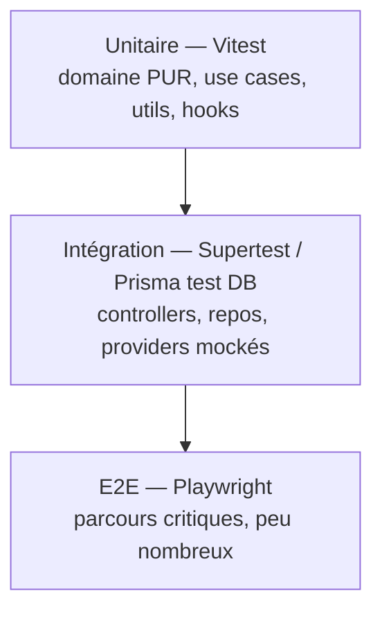

# Stratégie de tests & eval

> Principe directeur de [`CLAUDE.md`](../CLAUDE.md) : **un changement sans test n'est pas terminé.**

## 1. Pyramide de tests



Beaucoup d'unitaires (rapides, éco CI), quelques intégrations, très peu d'E2E ciblés.

## 2. Par couche

### Domaine (le plus important)
- **100 % sans I/O** : entités, VO, règles (`nextUnwatched`, transitions `WatchStatus`,
  invariants d'agrégats), `ProgressModel` par type.
- Outil : **Vitest**. Rapides, déterministes. Objectif de couverture domaine élevé (≥ 90 %).

### Application (use cases)
- Test des use cases avec **ports mockés** (repository, provider, event publisher en fakes).
- Vérifier l'**émission des événements** attendus (`MediaAdded`, `EpisodeWatched`…).

### Infrastructure
- Repos Prisma testés contre une **base de test** (Postgres jetable via docker/testcontainers).
- Adapters providers testés avec **HTTP mické** (nock/msw) — jamais d'appel réseau réel en CI.

### Présentation (API)
- **Supertest** : contrats HTTP, codes, validation DTO (Zod), erreurs.
- Tests de **contrat** vs `contracts/` (le SDK et l'API restent alignés).

### Frontend
- **Vitest + React Testing Library** : composants, hooks dédiés, stores Zustand, comportements
  (pas d'appel API réel → SDK mické, MSW pour l'HTTP).
- **Playwright** : parcours critiques (inscription, recherche→ajout, marquer épisode & reprise).
- Vérifs **accessibilité** (axe) et **visuelles** légères sur composants clés du design system.

## 3. Eval suite par fonctionnalité

Chaque fonctionnalité définit, **avant** implémentation (voir métriques de `CLAUDE.md`) :

```md
### Eval — <fonctionnalité>
- Problème utilisateur : ...
- Comportement attendu : ...
- Critères de réussite : ... (assertions vérifiables)
- Mesure d'amélioration : ... (métrique + valeur cible + méthode de mesure)
```

Exemples de mesures : temps de chargement (LCP), nb d'appels réseau par parcours, taux de
réussite d'un parcours E2E, couverture fonctionnelle, poids du bundle, score APIGreenScore.

Les evals vivent avec le module : `apps/api/src/modules/<x>/eval/` et
`apps/web/src/features/<x>/eval/`.

## 4. Données de test

- **Fakes de ports** pour l'unitaire (pas de mocks fragiles quand un fake suffit).
- **Fixtures** de médias (payloads TMDB/TVMaze figés) pour reproductibilité et zéro réseau.
- Base de test **isolée** et remise à zéro entre suites.

## 5. CI (bloquante)

Pipeline Turborepo, sur chaque PR :
1. `typecheck` (TS strict) 2. `lint` (+ règles d'architecture) 3. `test` (unit+intégration)
4. `build` 5. `test:e2e` (parcours critiques) 6. budgets **perf/éco** (poids bundle, requêtes).

Un rouge = pas de merge. Le cache Turborepo évite de tout rejouer (éco CI).

## 6. Qualité continue

- Couverture suivie (seuils par package, domaine le plus strict).
- `dependency-cruiser` (ou équivalent) pour **interdire** les imports violant la Dependency Rule
  (ex. `domain` important Prisma/NestJS).
- Tests non-régression ajoutés à chaque bug corrigé.
